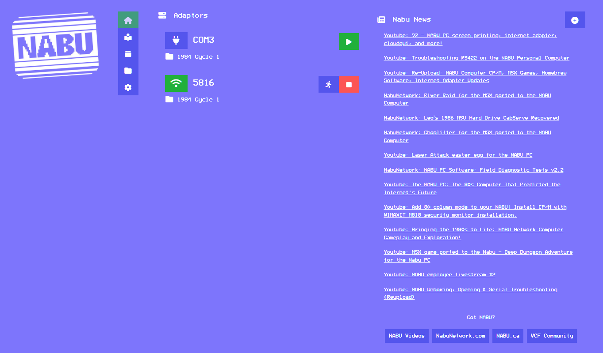
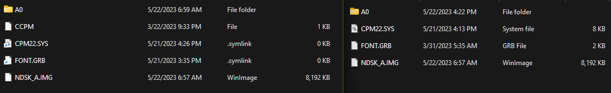
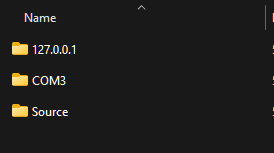

# NABU NetSim



> NOTE: `NNS` is used to abbreviate `NABU NetSim` in this document.

This is an Emulator for the NABU network adapter for use with real NABU PCs and Emulators (Marduk, MAME),
and can host multiple instances of either. Making it possible to host a whole NABU Network from one
adaptor. It supports the Classic NABU protocol as well as NHACP and RetroNet, and can be extended to support your own custom protocols via JavaScript.

> This is a work in progress, and may contain bugs, issues, poor code, etc.

**IF YOU ARE ON A VERSION BEFORE 0.9.8** 

 Many of the sources/settings previously in the config file have been moved to packages, and many settings are moved or removed. Drop in the default settings files, and then make your changes.

**There is no longer any need to choose your version, the UI and headless versions are now the same executable.**

## Stand Out Features

- > Supports multiple NABU adaptors, serial and TCP. You can use multiple serial adaptors and listen for clients on multiple ports at the same time if you so choose.
- > Supports NAPA packages, so you can drop in content updates, without a restart
- > Supports local file system NABU files and cycles, with the classic cycles included
- > Supports feeds from NABUNetwork.com and Nabu.ca.
- > Supports NHACP and Retronet, so it can run IshkurCPM and Cloud CPM.
- > Deeply integrated offline caching of remote files/programs.
- > Web UI for configuration, with news from NabuNetwork.com.
- > Extensible protocol support, you can add your own protocol handlers in Python or Javascript.

## Whats New(ish)

- > NAPA Package support, content is now provided as NAPA packages, so they can be updated seperately.

    Content from packages is symlinked into storage by default, but files users will alter are copied, to avoid clobbering.
- > User Storage Isolation
  - > This allows users to have their own copy of local storage files, and will avoid clobber issues with RetroNet and NHACP.
  
- > Hybrid IskurCPM support, allows physical disk drives
- > RetroNet TCP Client/Server Support
  - > Telnet/RetroNet Chat/etc are working.
- > Revamped Web UI Log Viewer, with pagination and search
  - > This does mean higher memory usage, but it's worth it.
- > JavaScript support has switched from Jint to ClearScript V8.
  - > This means support for all JavaScript Features like modules and the ability to use compile and use Typescript.
- > 98% of all byte arrays are now dealt with using `Span<T>` and `Memory<T>` for better performance, the fastest adaptor is now even faster!

## Known Issues

- > macOS ARM64 (Apple Silicon) builds were not signed, for the moment, please use the X64 build.
- > While using the X64 build on macOS, the serial port may not work.
- > RetroNet support is experimental.
- > Only one client may open and use the RetroNet TCP Server at a time, because RetroNet was designed that way.
- > NHACP support is experimental.
- > JavaScript support is experimental.
- > I'm 100% sure there are more.

## System Requirements

Console:

- OS: Windows, macOS, or Linux
- CPU: Average x64, arm, or arm64 CPU. (I've tested on a Raspberry Pi 3,4 and it works well.)
- Memory: 100MB base, 10MB per emulated adaptor, it uses less in my tests.

Web:

- Memory: 300MB minimum, 512MB-1GB recommended.

Realistically, a Pi 3 can serve a dozen or so adaptors, and a Pi 4 can handle 20+
A PC can potentially serve hundreds.

## Basics

### Configuration

```json
{
  "Settings": {
    // The path to where storage files will be kept.
    // By default, its "$CWD/Files"
    //"StoragePath": "./Files",

    // The path to where NABU programs will be kept.
    // These are the files shown under the "Local NABU Files" source.
    // By default, its "$CWD/NABUs"
    //"LocalProgramPath": "./NABUs",

    // If you have a script which will launch MAME as a NABU, 
    // like the one included with Windows builds of BriJohns' MAME source, 
    // you can specify it here: and the running man icon will appear to launch it
    // from the TCP adaptor summary on the Home page.
    //"EmulatorPath": "/path/to/emulator/start.script",

    "Adaptors": {
      "Serial": [
        {
          "Port": "COM3",
          "Source": "1984 Cycle 1", // <-- You change the inital source name here
          //"Program": "NAME" // <-- You can specify the initial program to load here
          "State": "Stop" // <-- You can specify the initial state of the adaptor here, Stop or Run.
        } // You can add as many serial adapters as you have connected.
      ],
      "TCP": [
        {
          "Port": 5816,
          "Source": "1984 Cycle 1"
        }
      ]
    },
    "Sources": [
      {
        "Name": "FigForth (latest)",
        "Path": "https://github.com/hanshuebner/nabu-figforth/raw/main/figforth.nabu"
      }
    ],
    "PackageSources": [
      {
        "Name": "Benevolent Society of NABUligans",
        "Path": "https://raw.githubusercontent.com/NABUligans/NAPA/main/repository/repo.json"
      }
    ]
  },
  // These are settings for the ASP.Net web server.
  "AllowedHosts": "*",
  "Urls": "http://*:5000" // <-- You change the port/hostname here
}
```

## Advanced

### Docker (Linux)

Preliminary Docker support is available, but is not extensively tested. It #WorksOnMyMachine.

```bash
  docker build -f "./Nabu.NetSimWeb/Dockerfile" --force-rm -t nnswui:dev .
  docker run -d \
    -p 5000:80 \
    -p 5816:5816 \
    -v /path/to/NABUs:/app/NABUs \ # for NABU files
    -v /path/to/Files:/app/Files \ # for NHACP/Retronet files
    -v /path/to/logs:/app/logs \   # Optional - for Logs, you can still view them in the container.
    -v /path/to/cache:/app/cache \ # Optional - for remote file caching.
    -v /dev/ttyUSB0:/dev/ttyUSB0 \ # Optional - for serial port(s)
    --name fabulous-falconer \
    --restart unless-stopped \
    nnswui:dev
```

## What's in the pipe (Coming Soon, in no particular order)

- > NabuNetwork.com Headless Support
  - > This will allow you to use the on NABU browser/launcher with NNS


## No hardware? No Problem

NABU PC can be emulated with MAME, and the standalone NABU emulator [Marduk](https://github.com/buricco/marduk)

## Brought to you by

- [NabuNetwork.com](https://nabunetwork.com)
- [NABU Discord](https://discord.gg/NgxTXvND2A)!

## Special Thanks

- [Leo "The Undisputed God-Legend" Binkowski](https://www.youtube.com/@leo.binkowski) : for preserving all that sweet hardware and software.
- DKGrizzley: for his PICO emulator to fill in the parts I couldn't figure out
- York University: for their recreation efforts, they are both numerous and awesome

- [Geek with Social Skills](https://www.youtube.com/@geekwithsocialskills)
- BriJohn: [NABU Mame](https://github.com/brijohn/mame/tree/nabupc_wip)
- GTAMP: [NABU MAME Windows Builds](https://gtamp.com/nabu)
- RetroNET and Discord Chaters (in no particular order):
  - Sark
  - Nath (The legend who decrypted NPAK files)
  - Guidol
  - VTTCP
  - HungryMarmot
- DJ Sures: For his work on Nabu.Ca
- And many many more

## Join us on Discord

The NABU Community is already coming together, join us!

> [NABU PC](https://discord.gg/NgxTXvND2A)
